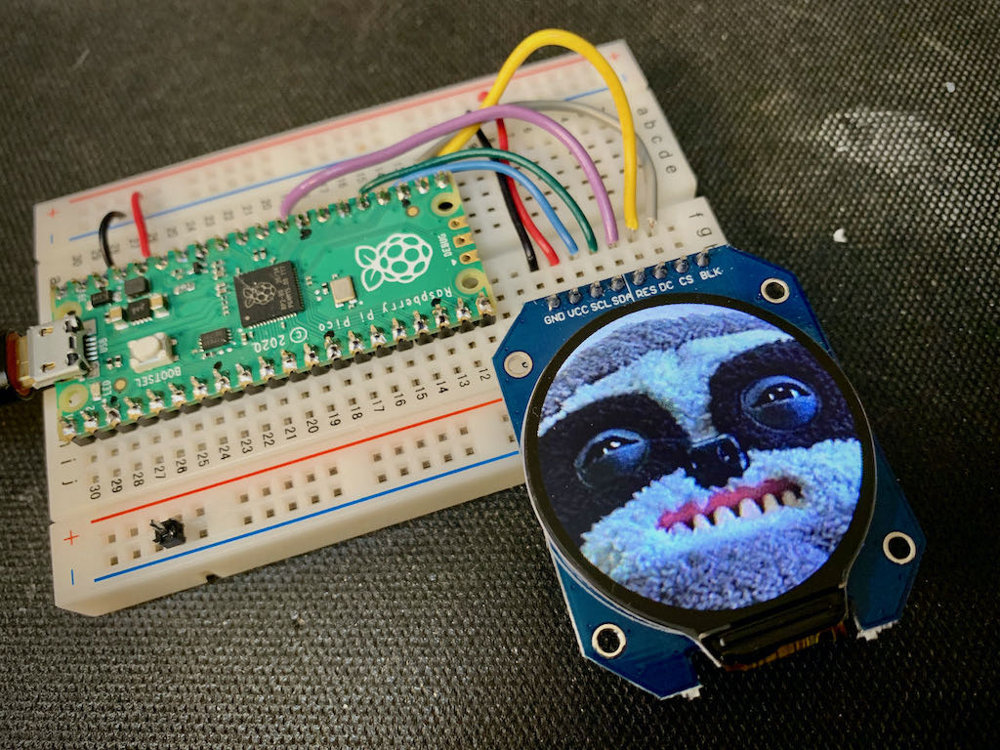
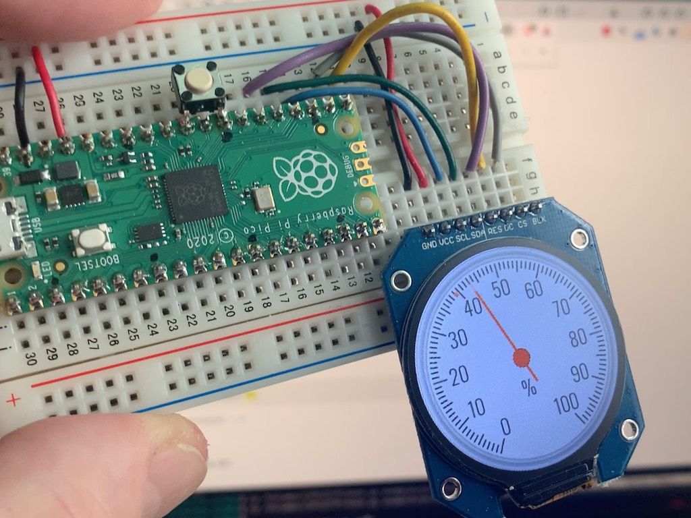
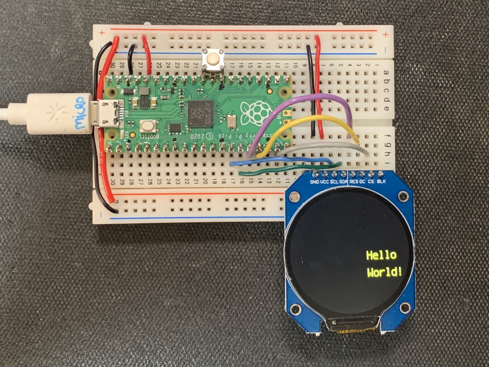
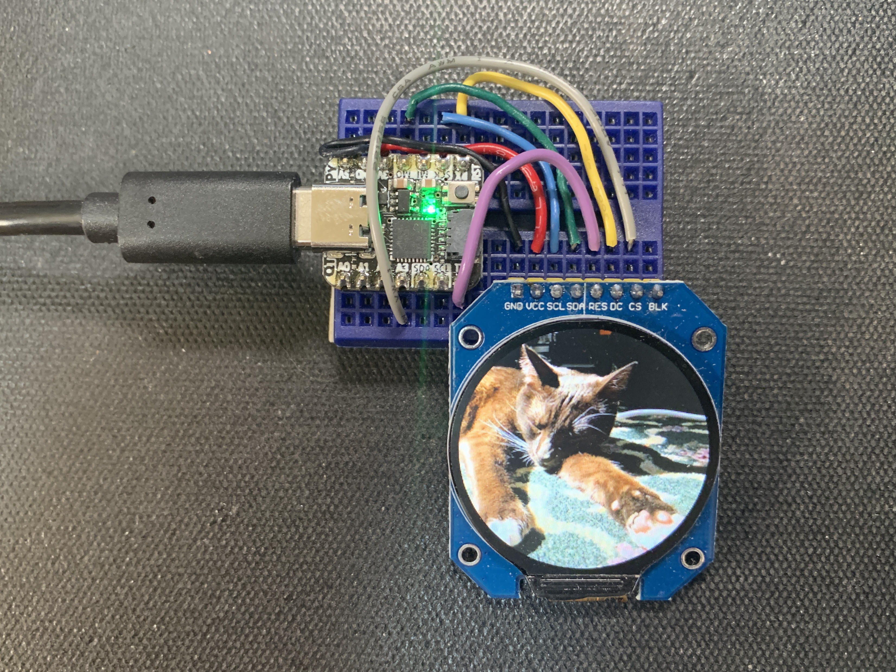

# CircuitPython GC9A01 demos

Demos showing how to use [CircuitPython displayio driver](https://github.com/tylercrumpton/CircuitPython_GC9A01) for GC9A01-based round LCDs.  This driver is available in the [CircuitPython Community Bundle](https://github.com/adafruit/CircuitPython_Community_Bundle), or you can install it by hand by copying the `gc9a01.py` file to your `CIRCUITPY/lib` directory.




## Usage

```py
import board
import displayio
import gc9a01
# Raspberry Pi Pico pinout, one possibility, at "southwest" of board
tft_clk = board.GP10 # must be a SPI CLK
tft_mosi= board.GP11 # must be a SPI TX
tft_rst = board.GP12
tft_dc  = board.GP13
tft_cs  = board.GP14
tft_bl  = board.GP15
spi = busio.SPI(clock=tft_clk, MOSI=tft_mosi)
display_bus = displayio.FourWire(spi, command=tft_dc, chip_select=tft_cs, reset=tft_rst)
display = gc9a01.GC9A01(display_bus, width=240, height=240, backlight_pin=tft_bl)

# ... normal circuitpython displayio stuff
```

## Installation

Each of the .py files in "examples" is its own demo. Copy one of these to be your CIRCUITPY's "code.py", like:
```
cp gc9a01_hellocircles.py /Volumes/CIRCUITPY/code.py
```

You'll need to install 'adafruit_display_text' library. The easiest way to do this is from a terminal:
```
circup install adafruit_display_text
```

You'll need to install the 'gc9a01' library. You can get that from the [Circuit_Python_Community bundle](https://github.com/adafruit/CircuitPython_Community_Bundle) at:
  https://github.com/adafruit/CircuitPython_Community_Bundle/releases
Unzip it and copy the `gc9a01.mpy` to the `CIRCUITPY/lib` folder, like:
```
cp ~/Downloads/circuitpython-community-bundle-6.x-mpy-20210403/lib/gc9a01.mpy /Volumes/CIRCUITPY/lib
```


## Examples

Check out the 'examples' directory for complete examples:

- 'gc9a01_helloworld' -- shows one way of doing polar coordinates
- 'gc9a01_hellocircles' -- similar to above but with floating circles using `vectorio`
- 'gc9a01_picture_locket' -- display a series of pictures, makes a nice locket if used with a QT Py Haxpress
- 'gc9a01_gauge_knob' -- round dial gauge using gauge background & dial bitmaps, showing `bitmaptools.rotozoom`

The examples attempt to auto-detect the board you're using. The currently detected boards:

- [QT Py M0 Haxpress](https://circuitpython.org/board/qtpy_m0_haxpress/)
- [Raspberry Pi Pico](https://circuitpython.org/board/raspberry_pi_pico/)
- [ItsyBitsy M4 Express](https://circuitpython.org/board/itsybitsy_m4_express/)


## Wiring

Wiring is dependent on board you're hooking it up to. The "SCL" and "SDA" lines need to be
hooked up to SPI pins "SCK" and "MOSI/TX". The `gc9a01_helloworld.py` has example wirings for three
different boards.  Here is an example for the Pico:

- VCC - Pico 3.3V(out)
- Gnd - Pico Ground
- SCL - Pico GP10 (SPI1 SCK)
- SDA - Pico GP11 (SPI1 TX)
- RES - Pico GP12
- DC  - Pico GP13
- CS  - Pico GP14
- BLK - Pico GP15 (can be omitted if you don't need backlight brightness control)




Here is an example for a QT Py Haxpress:

- VCC - QT Py 3.3V
- Gnd - QT Py Ground
- SCL - QT Py SCK 
- SDA - QT Py MO
- RES - QT Py TX
- DC  - QT Py A3
- CS  - QT Py A2
- BLK - unconnected




## Building your own dial gauges

There is a partial Python port of [@bikerglen's gauge-generator](https://github.com/bikerglen/round-lcd-gauges/tree/main/gauge-generator) in [`docs/gauge-generator`](./docs/gauge-generator). These scripts use the wonderful [Wand](https://docs.wand-py.org/en/0.6.6/) Python wrapper for ImageMagick's C API.


## Future Project Ideas:
- bargraph display using vectorio


### Notes to self:

- This repo started out as a GC9A01 driver for CircuitPython, but [@tylercrumpton](https://github.com/tylercrumpton/CircuitPython_GC9A01) beat me to the [CircuitPython Community Bundle](https://github.com/adafruit/CircuitPython_Community_Bundle) by a few days. Now it's a repo of demos
